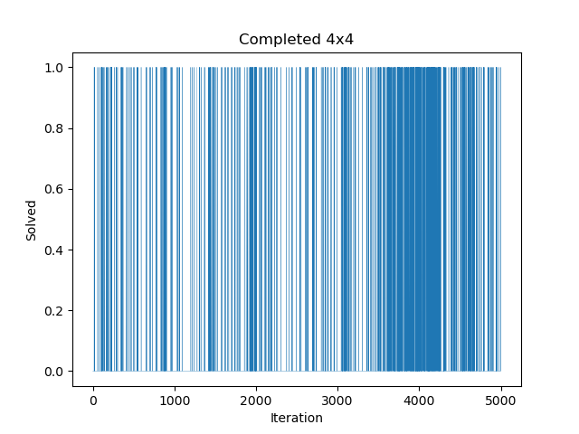
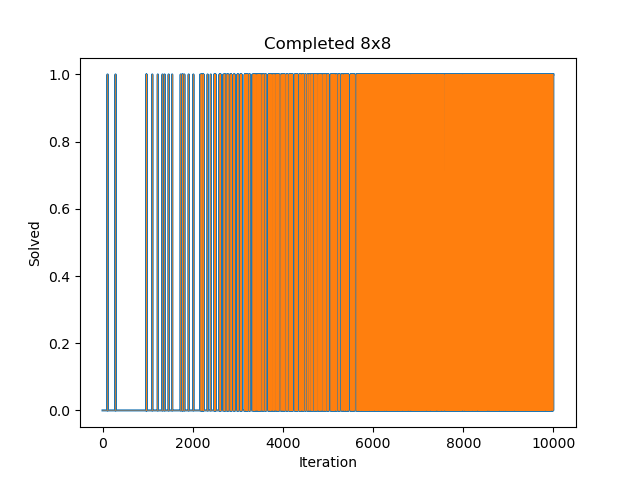
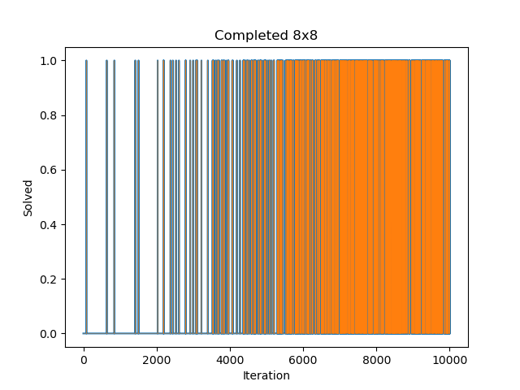

# Question 5, Part C

Important note: To run this code, you must be using 3.9.7 version of Python.

It is also important to note that Bridget Staley has taken a reinforcement learning course already and has code from that class that is being used to solve these problems.

To run this code, you depending on which environment for the cart_pole problem you will need to comment in line 91 and comment out line 93 for the regular environment. And vice versa for the right weighted environment.

## Possible extra libraries and Python version

```
pip install gym
```

Python verson: 3.9.7

## Explanation about the directory

Within this directory you will see 2 sub-folders, and three python files. Start with the ```main.py``` file. It includes a SARSA agent that solves the cartpole RL problem. There are 2 cartpole environment files. ```cartpole.py``` is the original environment, and ```cartpole_right_weighted.py``` is the second part of this question.

The next folder to look at is the ```Cart-Pole-Videos```. This includes three files. One file, ```best_agent_regular.mp4``` that was the best solved and rendered going for 18 seconds. The next file to look at is the ```right_weighted_best.mp4```. This file shows the right weighted problem solved. And as a bonus, there is another file for the regular cart-pole, ```second_best_regular.mp4```.

The Frozen Lake directory includes a ```main.py``` solves the frozen lake 4x4 problem and calls the ```agents.py``` file and has the SARSA agents. The most recent agent in there solves the 8x8 problem. The ```frozen_lake.py``` is the environment. And the ```frozen_8_main.py``` In the main function I add a 2% chance of death.

### Results for the 4x4



### Results for the 8x8 random



### Results for the 8x8 random with 2% chance of death



#### Analysis of above graphs

It is clear from the two graphs that by adding the 2% chance of death reduces the number of times that the agent solves the problem. In fact it took multiple runs to get the data you see above. That being said, it can still be solved, but the agent is not as quick in learning.